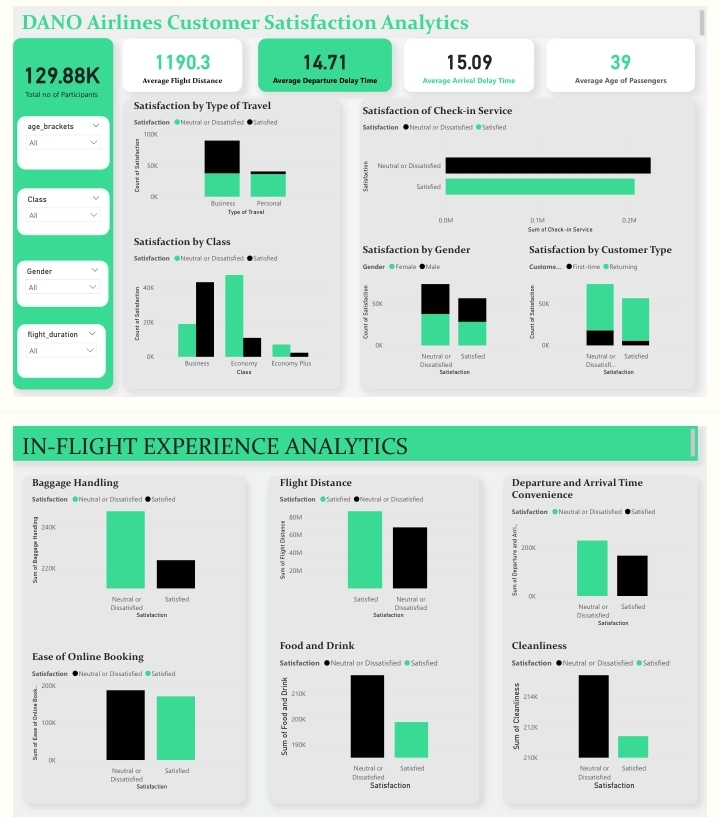

# Airline-Customer-Satisfaction-Analysis-

Dano Airlines customer satisfaction Analysis

## Table of Contents
- [Project Overview](#project-overview)
- [Data Sources](#data-sources)
- [Tools](#tools)
- [Data Preparation/Cleaning](#data-preparationcleaning)
- [Exploratory Data Analysis](#exploratory-data-analysis)
- [Data Analysis](#data-analysis)
- [Results/Findings](#resultsfindings)
- [Recommendations](#recommendations)
- [Limitations](#limitations)

## Project Overview
This project focuses on analyzing the most recent passenger survey data from Dano Airlines, where customer satisfaction has fallen below 50% for the first time in the company's history. Through a detailed examination of the survey results, the goal is to identify the critical factors affecting satisfaction and provide data-driven recommendations to help the leadership team address these issues and improve overall performance.

## Data Sources
The main dataset for this analysis is the 'airline_data.xlsx' file, which includes comprehensive details about each passenger, their flight characteristics, and travel type. It also captures their evaluations of various factors such as cleanliness, comfort, service quality, and overall flight experience.

## Tools

- Microsoft excel: For data cleaning
- Power BI: For data analysis and visualization 

## Data Preparation/Cleaning
During the data preparation stage, I carried out the following tasks:

- Loaded and inspected the dataset for a preliminary overview.

- Cleaned and formatted the data to ensure consistency and accuracy for analysis.

## Exploratory Data Analysis 

1. What is the overall distribution of customer satisfaction scores?

2. Which service factors have the strongest impact on satisfaction?

3. How does satisfaction vary by passenger demographics?

4. What are the differences in satisfaction across flight classes?

5. What is the impact of flight characteristics on satisfaction?

6. How do delays affect customer satisfaction?

## Data Analysis
Below is a formula I worked with using an if statement to categorize the age into age brackets and flight distance into duration type.

=IF(C129741>55,"Old",IF(C129741>=31,"Middle Age",IF(C129741<31,"Adolescent","Invalid")))

=IF(G2>4000,"Long",IF(G2>=1001,"Medium",IF(G2<=1000,"Short","invalid")))

## Results/Findings

● The majority of customers are "Satisfied," but a significant number remain "Neutral or Dissatisfied," particularly in certain service areas.

● High satisfaction is seen in the check-in process, indicating it is one of the best-performing areas.

● Ease of online booking also has strong satisfaction scores, showing digital services are functioning well.

● Baggage handling shows a large proportion of dissatisfaction, indicating a major pain point for customers.

● Lower satisfaction levels for food and drink indicate that in-flight meals and beverages are not meeting customer expectations.

● Many customers are dissatisfied with the punctuality of flights, showing delays are a frequent issue.

● Male passengers show slightly higher satisfaction than female passengers, but the difference is not significant.

● Business travelers are more satisfied than personal travelers, likely due to different service expectations or needs.

● Returning customers have higher satisfaction levels compared to new customers.

● Business class passengers are the most satisfied, while Economy Plus passengers show the lowest satisfaction levels.

● Passengers on longer flights tend to report higher satisfaction compared to those on shorter flights.

● Delays in departure and arrival times are strongly correlated with customer dissatisfaction.

## Recommendations

- Focus on resolving issues related to lost, delayed, or damaged baggage to boost customer satisfaction.

- Reassess the quality and variety of food and beverages offered to improve satisfaction during flights.

- Optimize scheduling and operations to reduce departure and arrival delays. Improve communication and compensation for delays to mitigate customer frustration.

- Reevaluate the services and benefits provided in Economy Plus to align with customer expectations and justify the added cost.

- Identify the needs of personal (leisure) travelers and enhance services tailored for this segment to close the satisfaction gap with business travelers.

- Maintain the high standards in check-in and ease of online booking to sustain positive customer experiences.

- Since shorter flights report lower satisfaction, consider enhancing services or offering more perks on these routes to elevate the overall experience.

## Limitations

To be able to utilize certain parts of the dataset for my analysis, I had to group the age and flight distance data into smaller, more relevant categories.

● Age Groups:

- Adolescents: 0-30 years

- Middle Age: 31-54 years

- Old: 55+ years

● Flight Distance Categories:

- Long Distance: 4000+ km

- Medium Distance: 1001-3999 km

- Short Distance: 0-1000 km

